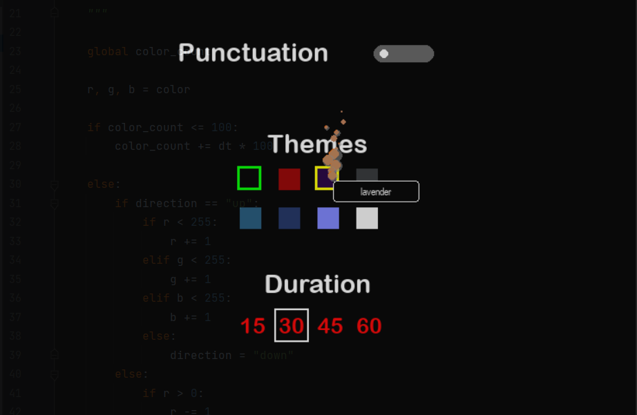
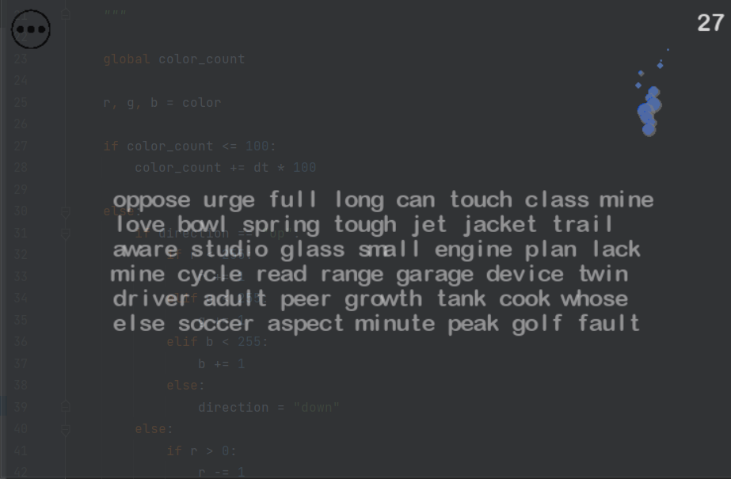
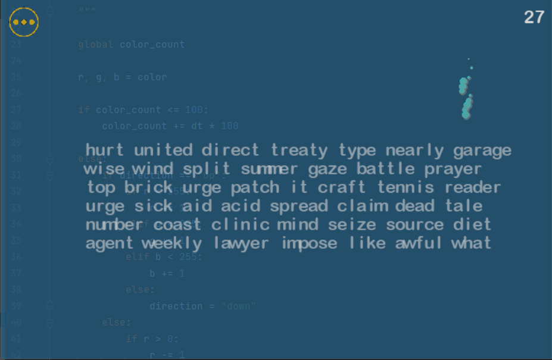
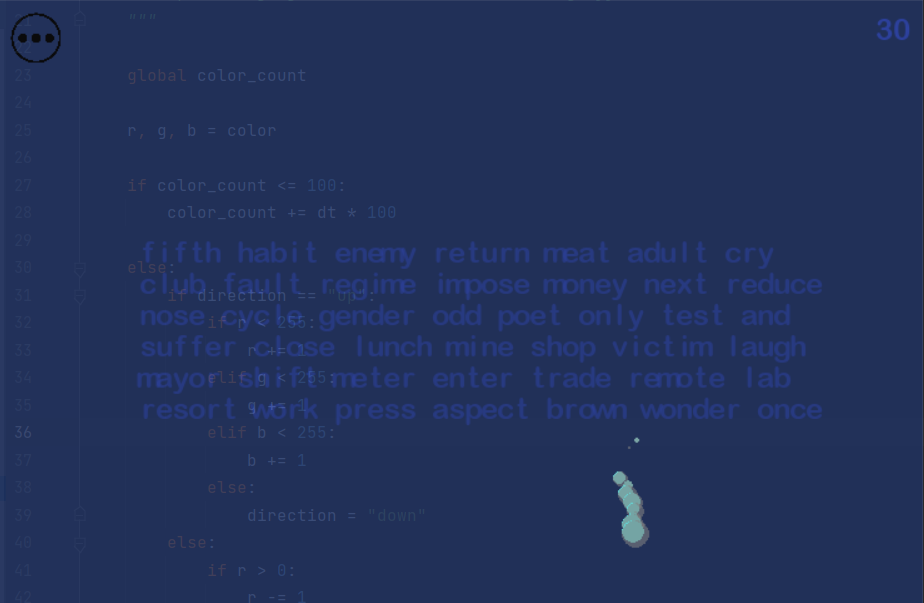

#  HeartBeat Typing Test
  - The hb typing test consists of a simple way to calculate your WPM and Accuracy.
  - The main point is the aesthetic look which was aimed for while making it, such as the **translucent background**,
    **hand-picked font** and **handwritten themes**(other than <a href="https://monkeytype.com/">monkeytype</a> which was inspired from the web typing test.).
  - Consisting of 8 different handwritten themes, customizable duration options and the choice of
    punctuation, the hb typing test is a well configurable typing test application which aims to hopefully 
    allow you to have your most enjoyable typing experience.

## Screenshots

## Themes
  - edgy black

  - captain america

  - lavender

  - monkeytype

  - aqua

  - neo city

  - unicorn

  - subtle white

